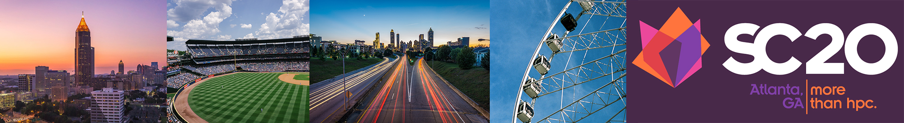

<!---
Correctness 2018: Second International Workshop on Software Correctness for HPC Applications
------

#### November 18, 2019
#### Colorado Convention Center, Room: TBD
#### Denver, Colorado, USA
##### Held in conjunction with SC19: [The International Conference for High Performance Computing, Networking, Storage and Analysis](https://sc19.supercomputing.org/)
##### In cooperation with 
-->

<h2>Correctness 2019: Third International Workshop on Software Correctness for HPC Applications</h2>

<h4> November 18, 2019 (full day) </h4>

<h4> Colorado Convention Center, Room: 712 </h4>

<h4> Denver, Colorado, USA </h4>

<h5> Held in conjunction with SC19: <a href="https://sc19.supercomputing.org/">The International Conference for High Performance Computing, Networking, Storage and Analysis</a> </h5>

In cooperation with  

----

Ensuring correctness in high-performance computing (HPC) applications is one of the fundamental challenges that the HPC community faces today. While significant advances in verification, testing, and debugging have been made to isolate software errors (or defects) in the context of non-HPC software, several factors make achieving correctness in HPC applications and systems much more challenging than in general systems software—growing heterogeneity (architectures with CPUs, GPUs, and special purpose accelerators), massive scale computations (very high degree of concurrency), use of combined parallel programing models (e.g., MPI+X), new scalable numerical algorithms (e.g., to leverage reduced precision in floating-point arithmetic), and aggressive compiler optimizations/transformations are some of the challenges that make correctness harder in HPC. The following report lays out the key challenges and research areas of HPC correctness: [DOE Report of the HPC Correctness Summit](https://www.osti.gov/biblio/1470989).

As the complexity of future architectures, algorithms, and applications in HPC increases, the ability to fully exploit exascale systems will be limited without correctness. With the continuous use of HPC software to advance scientific and technological capabilities, novel techniques and practical tools for software correctness in HPC are invaluable.

The goal of the Correctness Workshop is to bring together researchers and developers to present and discuss novel ideas to address the problem of correctness in HPC. The workshop will feature contributed papers and invited talks in this area.

----
### <a class="anchor" name="topics">Workshop Topics</a>

Topics of interest include, but are not limited to:

#### Correctness in Scientific Applications and Algorithms
* Formal methods and rigorous mathematical techniques for correctness in HPC applications
* Frameworks to address the challenges of testing complex HPC applications (e.g., multiphysics applications)
* Approaches for the specification of numerical algorithms with the goal of correctness checking
* Error identification in the design and implementation of numerical algorithms using finite-precision floating point numbers

#### Tools for Debugging, Testing, and Correctness Checking
* Tools to control the effect of non-determinism when debugging and testing HPC software
* Scalable debugging solutions for large-scale HPC applications
* Scalable tools for model checking, verification, certification, or symbolic execution
* Static and dynamic analysis to test and check correctness in the entire HPC software ecosystem
* Predictive debugging and testing approaches to forecast the occurrence of errors in specific conditions
* Machine learning and anomaly detection for bug detection and localization

#### Programing Models and Runtime Systems Correctness
* Correctness in emerging HPC programing models
* Analysis of software error propagation and error handling in HPC runtime systems and libraries
* Metrics to measure the degree of correctness of HPC software
* Specifications to check the correctness of runtime systems

#### Other Areas
* Large databases of bug reports and/or reproducible test cases of HPC software
* Benchmarks to test the effectiveness of HPC correctness tools

----
### <a class="anchor" name="submissions"> Submissions and Format </a>

Authors are invited to submit manuscripts in English structured as technical or experience papers not exceeding **8 pages** of content, including everything. Submissions must use the [IEEE format](https://www.ieee.org/conferences/publishing/templates.html).

Submitted papers will be peer-reviewed by the Program Committee and accepted papers will be published by IEEE Xplore via TCHPC.

Submitted papers must represent original unpublished research that is not currently under review for any other venue. Papers not following these guidelines will be rejected without review. Submissions received after the due date, exceeding length limit, or not appropriately structured may also not be considered. At least one author of an accepted paper must register for and attend the workshop. Authors may contact the workshop organizers for more information. Papers should be submitted electronically at: [https://submissions.supercomputing.org/](https://submissions.supercomputing.org/).

#### SC Reproducibility Initiative

We encourage authors to submit an **optional** artifact description (AD) appendix along with their paper, describing the details of their software environments and computational experiments to the extent that an independent person could replicate their results. The AD appendix is not included in the 8-page limit of the paper and should not exceed **2 pages** of content. For more details of the **SC Reproducibility Initiative** please see: [https://sc19.qltdclient.com/submit/reproducibility-initiative/](https://sc19.qltdclient.com/submit/reproducibility-initiative/).

---
###  <a class="anchor" name="proceedings"> Proceedings </a>

The proceedings will be archived in IEEE Xplore via [TCHPC](https://tc.computer.org/tchpc/).

---
### <a class="anchor" name="dates"> Important Dates </a>
Due to several requests, we have extended the submission deadline to Aug/19 (we will not make further extensions).

* Paper submissions due: ~~August 9, 2019~~ **Extended:** August 19, 2019 
* Notification of acceptance: September 20, 2019
* E-copyright registration completed by authors (firm): ~~October 3, 2019~~ TBD
* Camera-ready papers due (firm): ~~October 8, 2019~~ TBD 

All time zones are AOE.

---
### <a class="anchor" name="org">Organizers</a>

[Ignacio Laguna](http://lagunaresearch.org/), LLNL  
[Cindy Rubio-González](http://web.cs.ucdavis.edu/~rubio/), UC Davis

---
### <a class="anchor" name="pc">Program Committee</a>

[Alper Altuntas](https://staff.ucar.edu/users/altuntas), National Center for Atmospheric Research, USA  
[Allison H. Baker](https://staff.ucar.edu/users/abaker), National Center for Atmospheric Research, USA  
[John Baugh](https://www.ccee.ncsu.edu/people/jwb/), North Carolina State University, USA  
[Patrick Carribault](http://www.cea.fr/), CEA-DAM, France   
[Ganesh Gopalakrishnan](https://www.cs.utah.edu/~ganesh/), University of Utah, USA  
[Jeff Huang](https://parasol.tamu.edu/~jeff/), Texas A&M University, USA  
[Geoffrey C. Hulette]( http://www.sandia.gov/), Sandia National Laboratories, USA   
[Sriram Krishnamoorthy](http://hpc.pnl.gov/people/sriram/), Pacific Northwest National Laboratory, USA  
[Michael O. Lam](https://w3.cs.jmu.edu/lam2mo/), James Madison University, USA  
[Jackson Mayo]( http://www.sandia.gov/), Sandia National Laboratories, USA  
[Tristan Ravitch]( https://galois.com/team/tristan-ravitch/), Galois, Inc, USA  
[Nathalie Revol](http://perso.ens-lyon.fr/nathalie.revol/), INRIA - ENS de Lyon, France  
[Emmanuelle Saillard](http://emmanuellesaillard.fr/), INRIA Bordeaux, France   
[Markus Schordan]( https://people.llnl.gov/schordan1), Lawrence Livermore National Laboratory, USA  

---
### <a class="anchor" name="venue">Venue</a>

The Colorado Convention Center  
700 14th St, Denver, CO 80202  
Room: 712

---
### <a class="anchor" name="program">Program</a>
 

**Keynote Speaker 1 (Morning Session)**
 

#### [Alex Aiken](http://theory.stanford.edu/~aiken/), Alcatel-Lucent Professor of Computer Science, Stanford University

**Bio:**
Alex Aiken is the Alcatel-Lucent Professor of Computer Science at Stanford. Alex received his Bachelors degree in Computer Science and Music from Bowling Green State University in 1983 and his Ph.D. from Cornell University in 1988. Alex was a Research Staff Member at the IBM Almaden Research Center (1988-1993) and a Professor in the EECS department at UC Berkeley (1993-2003) before joining the Stanford faculty in 2003. His research interest is in areas related to programming languages. He is an ACM Fellow, a recipient of ACM SIGPLAN's Programming Languages Achievement Award and Phi Beta Kappa's Teaching Award, and a former chair of the Stanford Computer Science Department.

 
#### *Reasoning About Floating Point in the Real World*

**Abstract:** The formal verification of floating point code as it exists in widely-used, highly-optimized libraries is very challenging, in fact so challenging that formal proofs, where they exist, are done manually.  This talk will discuss a combination of recent results that allow some important codes to be verified fully automatically, as well as additional challenges that have yet to be overcome.

 

**Keynote Speaker 2 (Afternoon Session)**
 

#### [Allison Baker](https://staff.ucar.edu/users/abaker), Project Scientist III, National Center for Atmospheric Research (NCAR)

**Bio:**
Allison Baker is a Project Scientist III at the National Center for Atmospheric Research (NCAR). Her research interests include high-performance computing, performance analysis, iterative linear solvers, Earth System models, data compression, and verification techniques. She earned her B.S. in Mechanical Engineering from Rice University and her Ph.D. in Applied Mathematics from the University of Colorado in 2003. Then she joined the Center for Applied Scientific Computing at Livermore National Laboratory, where she made contributions to parallel algebraic multigrid methods and preparations for exascale computing as part of the HYPRE solvers team. In 2012, she joined the Application Scalability and Performance group at NCAR and works primarily on improvement efforts for the the Community Earth System Model (CESM).  Most recently, she has led the development of tools for determining whether CESM climate runs are statistically distinguishable (for scenarios where bit-for-bit reproducibility is not possible) and an investigation into the feasibility and science implications of applying lossy data compression to CESM output data.

 
#### *Contained Chaos: Quality Assurance for the Community Earth System Model*

**Abstract:** State-of-the-science climate model are valuable tools for understanding past and present climates and are particularly vital for addressing otherwise intractable questions about future climate scenarios.  Because the simulation output may affect societal responses to the changing climate, maintaining model confidence and reliability is critical for institutions like the National Center for Atmospheric research, which leads the development of the popular Community Earth System Model (CESM).  CESM models the Earth system by simulating the major Earth system components (e.g., atmosphere, ocean, land, river, ice, etc.) and the interactions between them.  These complex processes result in a model that is inherently chaotic, meaning that small perturbations can cause large effects.  For this reason, ensemble methods are common in climate studies, as a collection of simulations are needed to understand and characterize this uncertainty in the climate model system.  While climate scientists typically use initial condition perturbations to create ensemble spread, similar effects can result from seemingly minor changes to the hardware or software stack.  This sensitivity makes quality assurance challenging, and defining "correctness" separately from bit-reproducibility is really a practical necessity. Our approach casts correctness in terms of statistical distinguishability such that the problem becomes one of making decisions under uncertainty in a high-dimensional variable space.  We developed a statistical testing framework that can be thought of as hypothesis testing combined with Principal Component Analysis (PCA), which not only captures changes in individual variables but in the relationship between variables as well. We are currently delving into the technical details of the PCA analysis to better describe the probabilistic properties of our testing framework and improve its robustness. In other recent work, we are developing tools to identify and understand the reason for statistically distinct output that will aid developers in root cause analysis.  This talk will overview our multi-year effort to better evaluate the correctness of CESM and detail promising recent developments.

 

**Invited Industry Talk (Afternoon Session)**
 

#### *Taming the Digital Wild West: Using Domain Specific Languages to Enforce Correctness Properties in Data Science, Machine Learning, and Scientific Modeling*
[Galois, Inc.](https://galois.com/)

**Abstract:** Recent advances in machine learning and data science have resulted in a sort of digital gold rush.  Early wins for classification, regression, and deep learning have been driven by advertising and recommendation systems.  The cost of errors in these systems is low, which has led to a prioritization of minimizing execution time, often without regard to correctness considerations.  These priorities have resulted in many state-of-the-art methods operating as a black box which often fails to generalize.  In this talk we discuss the use of domain specific languages (DSLs) to address these short comings, build trust in algorithms and the correctness of their results, and to improve the accessibility of machine learning and data science algorithms and methods to scientists, policy makers, and other users with critical application areas.  We present the advantages of both embedded and stand-alone DSLs for not only usability and performance, but also for analysis and formal reasoning; discuss the use of DSLs to enforce different types of correctness constraints in domain models; the challenges presented by proving the implementation of a DSL is correct; and examples of successful application of DSLs by domain scientists.

 
 

#### Workshop Schedule

###### Keynote 1
<table>
<tr><td width="15">  </td> <td>09:00am - 09:05am:  Opening remarks    </td> </tr>
<tr><td width="15">  </td> <td>09:05am - 10:00am:  Keynote Speaker 1:  <b>"Reasoning About Floating Point in the Real World"</b>, Alex Aiken (Stanford University) </td> </tr>
</table>

###### Break
<table>
<tr><td width="15">  </td> <td>10:00am - 10:30am:  Break (coffee provided by SC19) </td> </tr>
</table>

###### Debugging Tools (Chair: Michael Lam)
<table>

<tr><td width="15">  </td> <td>10:30am - 11:00am:  <b>"Debugging and optimization of HPC programs with the Verrou tool"</b>, Bruno Lathuilière, François Fevotte </td> </tr>

<tr><td width="15">  </td> <td>11:00am - 11:30am:  <b>"Exploring Regression of Data Race Detection Tools Using DataRaceBench"</b>, Pei-Hung Lin, Chunhua Liao, Markus Schordan, Ian Karlin </td> </tr>
</table>

###### Floating-Point Mixed Precision (Chair: Emmanuelle Saillard)
<table>
<tr><td width="15">  </td> <td>11:30am - 12:00pm:  <b>"Toward Multi-Precision, Multi-Format Numerics"</b>, David Thien, Bill Zorn, Pavel Panchekha, Zachary Tatlock </td> </tr>

<tr><td width="15">  </td> <td>12:00pm - 12:30pm:  <b>"Tool Integration for Source-Level Mixed Precision"</b>, Michael O. Lam, Tristan Vanderbruggen, Harshitha Menon, Markus Schordan </td> </tr>
</table>

###### Lunch Break
<table>
<tr><td width="15">  </td> <td>12:30pm - 02:00pm:  Lunch (on your own) </td> </tr>
</table>

###### Keynote 2
<table>
<tr><td width="15">  </td> <td>02:00pm - 03:00pm:  Keynote Speaker 2:  <b>Contained Chaos: Quality Assurance for the Community Earth System Model</b>, Allison Baker (NCAR) </td> </tr>
</table>

###### Break
<table>
<tr><td width="15">  </td> <td>03:00pm - 03:30pm:  Break (coffee provided by SC19) </td> </tr>
</table>

###### Invited Talk
<table>
<tr><td width="15">  </td> <td>03:30pm - 04:30pm:  <b> Taming the Digital Wild West: Using Domain Specific Languages to Enforce Correctness Properties in Data Science, Machine Learning, and Scientific Modeling </b>, <a href="https://galois.com/">Galois, Inc.</a>  </td> </tr>
</table>

###### Correctness in Algorithms and Applications (Chair: Markus Schordan)
<table>
<tr><td width="15">  </td> <td>04:30pm - 05:00pm:  <b>"Bounded Verification of Sparse Matrix Computations"</b>, Tristan Dyer, Alper Altuntas, John Baugh</td> </tr>

<tr><td width="15">  </td> <td>05:00pm - 05:30pm:  <b>"Investigating the Impact of Mixed Precision on Correctness for a Large Climate Code"</b>, Daniel J. Milroy, Allison H. Baker, John M. Dennis, Andrew Gettelman, Dorit M. Hammerling </td> </tr>
</table>

---
###  <a class="anchor" name="contact">Contact Information</a>
Please address workshop questions to Ignacio Laguna (ilaguna@llnl.gov) and/or Cindy Rubio-González (crubio@ucdavis.edu).

---
### <a class="anchor" name="previous">Previous Workshops</a>
- [Correctness 2017](https://correctness-workshop.github.io/2017/)
- [Correctness 2018](https://correctness-workshop.github.io/2018/)

